# Hey, I'm Sumeet Dube 👋

**Software Developer from Mumbai — I ideate, architect, build, and ship.**

---

I'm a Software Developer who works across the entire stack — backend, frontend, mobile apps, databases, and deployment. I don't just write code; I ideate products from scratch, design the architecture, decide the tech stack, and ship to production. Currently leading software development at **Parkomate Solutions**, where I built the entire platform end-to-end — from system design to live deployment across multiple sites. I also self-host my own infrastructure on a personal NAS because I like owning the full pipeline.

---

## 🚗 What I'm Building — Parkomate Solutions

Leading software development for a **multi-tenant valet management platform** — ideated the architecture, chose the tech stack, and built it end-to-end:

- **System design from scratch** — designed the full architecture covering backend services, mobile app, database schema, and client-server communication
- Architected for **1,000+ vehicle check-ins/check-outs per site per day** with concurrent client requests
- **Site-level data isolation** — each location operates as an independent tenant with transactional guarantees
- Built **REST APIs** managing the full vehicle lifecycle: authentication → check-in → status sync → check-out
- Real-time state propagation across valet staff, admins, and customer-facing clients
- Developed the **Flutter mobile app** with on-device ML Kit for offline number plate recognition (zero network dependency for ANPR)
- **Deployed and maintaining** the full stack on Linux VPS — MySQL, Node.js, subdomain routing, process management

---

## 🏗 Core Stack

| Domain | Technologies |
|---|---|
| **Languages** | Java · Python · C++ · Node.js · PHP |
| **Backend** | REST APIs · Concurrent Request Handling · MySQL · SQLite |
| **Frontend & Web** | HTML · CSS · JavaScript |
| **Mobile** | Flutter · ML Kit (on-device inference) |
| **Infrastructure** | Linux · Docker · VPS · Cloudflare Tunnel · Self-hosted NAS |
| **AI/ML** | PyTorch · VGG16 · CNN-based classifiers |

---

## 🧪 Notable Projects

**🤖 [AI Interview Simulator](https://sumeetdube.in)** — Full-stack interview chatbot with backend session management, prompt orchestration, response streaming, and a polished frontend. Self-hosted on a personal NAS with Docker + Cloudflare Tunnel. Try it live on my portfolio.

**🌐 Freelance — Ayurom LLP** — Delivered a complete website end-to-end per client specs. Self-hosted on a NAS using Docker, managed domain migration, DNS, HTTPS, and Cloudflare Tunnel routing. Currently building a desktop app extension for their platform.

**📊 Flowchart Drawer** — Python automation tool (built at DRDO) that reads structured Excel data, processes it through SQLite, and generates flowchart PDFs for process visualization.

**♻️ Waste Classification (VGG16)** — Deep learning image classifier distinguishing recyclable vs organic waste using transfer learning on CNNs.

---

## 📈 GitHub Stats

<picture>
  <source media="(prefers-color-scheme: dark)" srcset="./profile/stats-dark.svg" />
  <source media="(prefers-color-scheme: light)" srcset="./profile/stats-light.svg" />
  
</picture>
<picture>
  <source media="(prefers-color-scheme: dark)" srcset="./profile/top-langs-dark.svg" />
  <source media="(prefers-color-scheme: light)" srcset="./profile/top-langs-light.svg" />
  
</picture>

 

<picture>
  <source media="(prefers-color-scheme: dark)" srcset="https://streak-stats.demolab.com?user=dsumeet14&theme=tokyonight&hide_border=true&background=0f0f0f&ring=00ffc6&fire=00ffc6&currStreakLabel=00ffc6" />
  <source media="(prefers-color-scheme: light)" srcset="https://streak-stats.demolab.com?user=dsumeet14&theme=default&hide_border=true" />
  
</picture>

---

## 📊 Activity Graph

---

## 🕹 Contribution Snake

<picture>
  <source media="(prefers-color-scheme: dark)" srcset="https://raw.githubusercontent.com/dsumeet14/dsumeet14/output/github-snake-dark.svg" />
  <source media="(prefers-color-scheme: light)" srcset="https://raw.githubusercontent.com/dsumeet14/dsumeet14/output/github-snake.svg" />
  
</picture>

---

**[🌐 Explore my portfolio & AI interview bot →](https://sumeetdube.in)**

